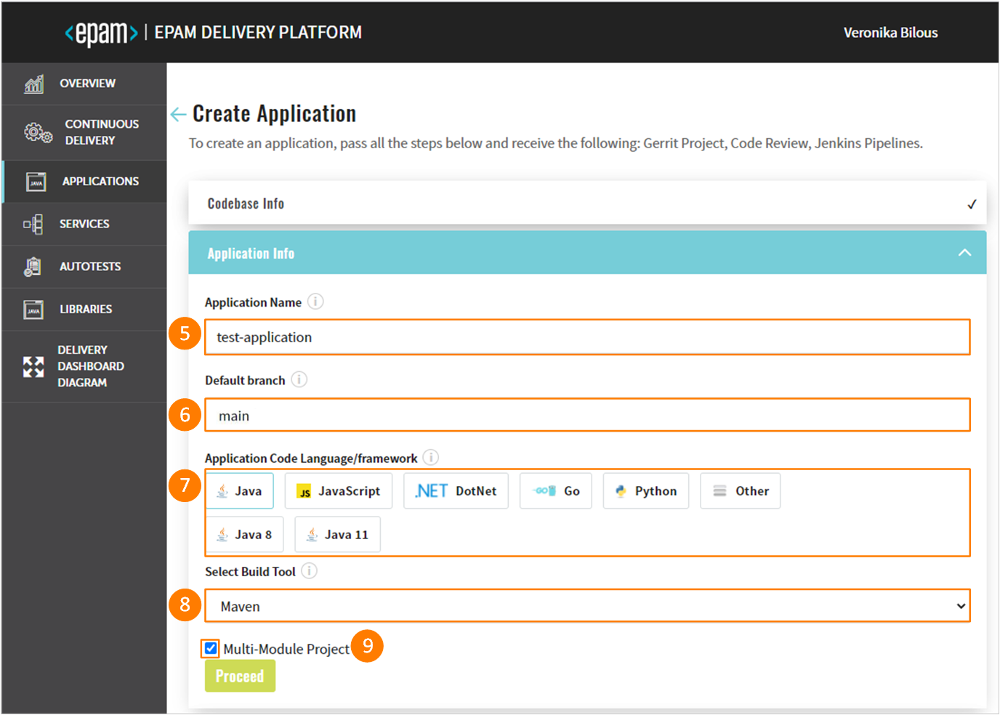
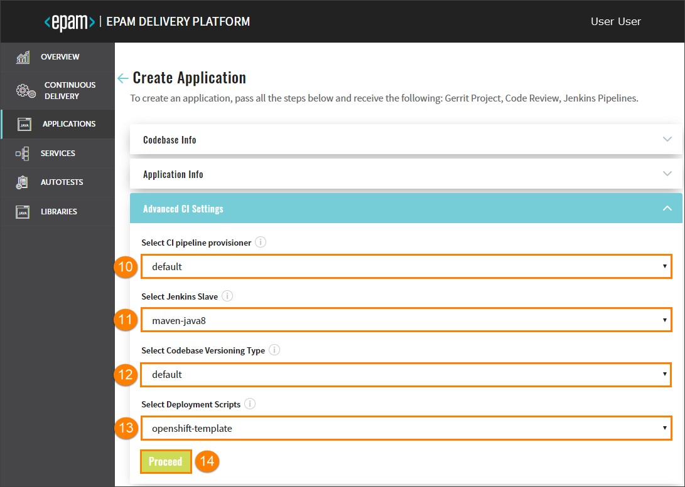
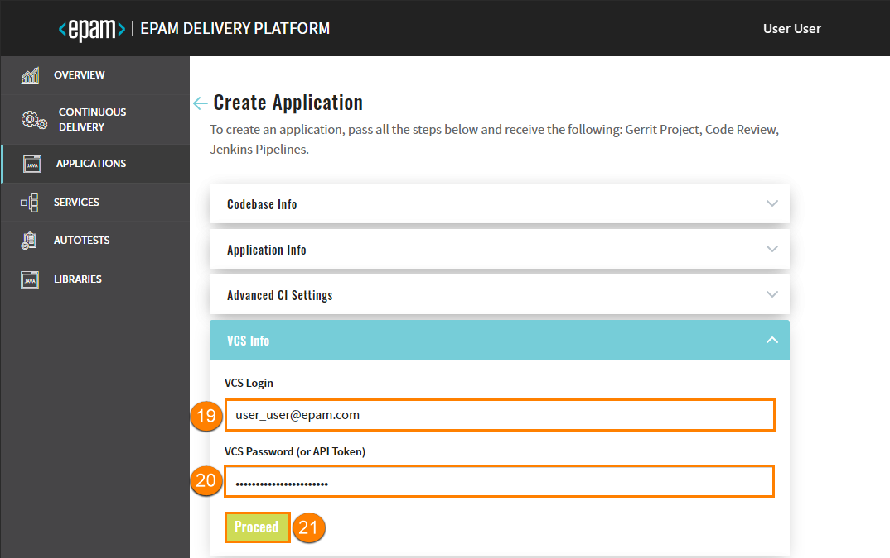
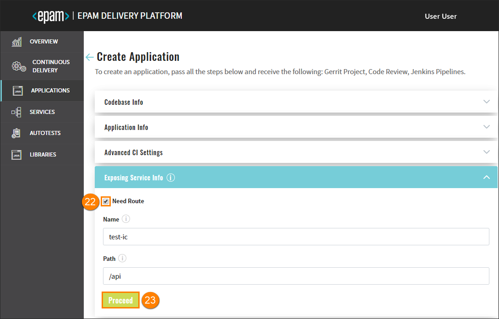

# Add Applications

Admin Console allows to create, clone, import an application and add it to the environment with its subsequent deployment in Gerrit and building of the Code Review and Build pipelines in Jenkins. 

To add an application, navigate to the **Applications** section on the left-side navigation bar and click the Create button.

Once clicked, the six-step menu will appear: 

* The Codebase Info Menu
* The Application Info Menu
* The Advanced CI Settings Menu
* The Version Control System Info Menu
* The Exposing Service Info Menu
* The Database Menu

_**NOTE**: The Version Control System Info menu is available in case this option is predefined._

After the complete adding of the application, inspect the [Check Application Availability](#Check Application Availability) part.

## The Codebase Info Menu

1. In the **Codebase Integration Strategy** field, select the necessary option that is the configuration strategy for the replication with Gerrit:
    - Create – creates a project on the pattern in accordance with an application language, a build tool, and a framework.
    - Clone – clones the indicated repository into EPAM Delivery Platform. While cloning the existing repository, you have to fill in the additional fields as well.
    - Import - allows configuring a replication from the Git server. While importing the existing repository, you have to select the Git server and define the respective path to the repository.

2. In the **Git Repository URL** field, specify the link to the repository that is to be cloned.
3. Select the **Codebase Authentication** check box and fill in the requested fields:
    - Repository Login – enter your login data.
    - Repository password (or API Token) – enter your password or indicate the API Token.
    
    _**NOTE**: The Codebase Authentication check box should be selected just in case you clone the private repository. If you define the public one, there is no need to enter credentials._ 
4. Click the Proceed button to be switched to the next menu.

    ## The Application Info Menu

    

5. Type the name of the application in the **Application Name** field by entering at least two characters and by using the lower-case letters, numbers and inner dashes.

    _**INFO:** If the Import strategy is used, the Application Name field will not be displayed._
    
6. Select any of the supported application languages with its framework in the **Application Code Language/framework** field:

    - Java – selecting Java allows using the Spring Boot framework.
    - JavaScript - selecting JavaScript allows using the React framework.
    - .Net - selecting .Net allows using the NET Core framework.
    - Other - selecting Other allows extending the default code languages when creating a codebase with the clone/import strategy. To add another code language, inspect the [Add Other Code Language](add_other_code_language.md) section on GitHub.

    _**NOTE**: The Create strategy does not allow to customize the default code language set._
    
7. Choose the necessary build tool in the Select Build Tool field:

    - Java - selecting Java allows using the Gradle or Maven tool.
    - JavaScript - selecting JavaScript allows using the NPM tool.
    - .Net - selecting .Net allows using the .Net tool.

    _**NOTE**: The Select Build Tool field disposes of the default tools and can be changed in accordance with the selected code language._
8. Select the **Multi-Module Project** check box that becomes available if the Java code language and the Maven build tool are selected. 

    _**NOTE**: If your project is a multi-modular, add a property to the project root POM-file:_

    `<deployable.module> for a Maven project.`

    `<DeployableModule> for a DotNet project.`

9. Click the Proceed button to be switched to the next menu.

    ## The Advanced CI Settings Menu

    

10. Select job provisioner that will be used to handle a codebase. For details, refer to the [Add Job Provision](https://github.com/epmd-edp/jenkins-operator/blob/master/documentation/add-job-provision.md#add-job-provision) instruction and become familiar with the main steps to add an additional job provisioner.
11. Select Jenkins slave that will be used to handle a codebase. For details, refer to the [Add Jenkins Slave](https://github.com/epmd-edp/jenkins-operator/blob/master/documentation/add-jenkins-slave.md#add-jenkins-slave) instruction and inspect the steps that should be done to add a new Jenkins slave.  
12. The **Select Deployment Script** field has two available options: helm-chart/ openshift-template that are predefined in case it is OpenShift or EKS.  
13. Click the Proceed button to be switched to the next menu.

    ## The Version Control System Info Menu

    
    
14. Enter the login credentials into the **VCS Login** field.
15. Enter the password into the **VCS Password (or API Token)** field OR add the API Token.
16. Click the Proceed button to be switched to the next menu.
    
    _**NOTE**: The VCS Info step will be skipped in case you don`t need to integrate the version control for the application deployment. If the cloned application included the VCS, you will have to complete this step as well._

    ## The Exposing Service Info Menu

    

17. Select the **Need Route** check box to create a route component in the OpenShift project for the externally reachable host name. As a result, the added application will be accessible in a browser.
    
    Fill in the necessary fields:
    
    - Name – type the name by entering at least two characters and by using the lower-case letters, numbers and inner dashes. The mentioned name will be as a prefix for the host name.
    - Path – specify the path starting with the **/api** characters. The mentioned path will be at the end of the URL path.
    
18. Click the Proceed button to be switched to the final menu.

    ## The Database Menu

    

19. Select the **Need Database** check box in case you need a database. Fill in the required fields:
    
    - Database – the PostgreSQL DB is available by default.
    - Version – the latest version (postgres:9.6) of the PostgreSQL DB is available by default.
    - Capacity – indicate the necessary size of the database and its unit of measurement (Mi – megabyte, Gi – gigabyte, Ti – terabyte). There is no limit for the database capacity.
    - Persistent storage – select one of the available storage methods: efs or gp2.
    
20. Click the Create button. Once clicked, the CONFIRMATION summary will appear displaying all the specified options and settings, click Continue to complete the application addition.
    
    
## Check Application Availability 
    
Once the application is added to the Applications list, you can check its data, simply click the application name and get access to the following:
    
1. General Info - displays common information about the created/cloned application.
2. Advanced CI Settings - displays the specified job provisioner, Jenkins slave, and a deployment script.
3. Branches - displays the status and name of the deployment branch, keeps the additional links to Jenkins and Gerrit.

    The **master** branch is the default one but you can create a new branch as well. To do this, perform the steps:
    
    - Click the Create button;
    - Fill in the required fields by typing the branch name and pasting the copied commit hash. To copy the commit hash, click the VCS link and select the necessary commit; 
    - Click the Proceed button and wait until the new branch will be added to the list.

4. Status Info - displays all the actions that were performed during the creation/cloning process.
    
After adding an application, the following will be created:
    
- Code Review and Build pipelines in Jenkins for this application. The Build pipeline will be triggered automatically if at least one environment is already added.
- A new project in Gerrit.
- SonarQube integration will be available after the Build pipeline in Jenkins is passed.
- Nexus Repository Manager will be available after the Build pipeline in Jenkins is passed as well.
    
_**INFO:** To open OpenShift, Jenkins, Gerrit, Sonar, and Nexus, click the Overview section on the navigation bar and hit the necessary link._