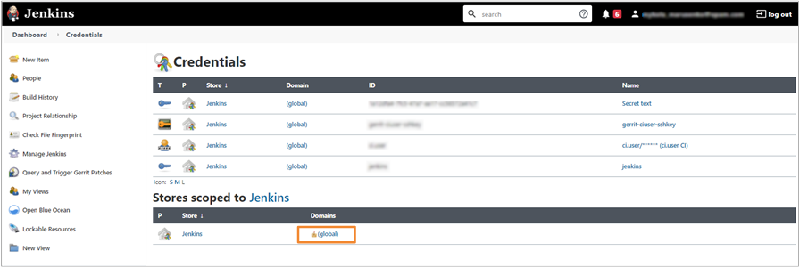

# Using Terraform Library in EDP

The support of Terraform was implemented in EDP, allowing to work with Terraform code that is processed by means of stages in **Code-Review** and **Build** pipelines, that are expected to be created after the Terraform Library is added. 

In the **Code-Review** pipeline the following stages are launched:

  - **checkout** stage, a standard step during which all files are checked out from a selected branch of the Git repository.
  
  - **terraform-lint** stage, that contains a script that performs the following actions:
  
    a. Check if the repository contains the _.terraform-version_ file, where the information about the Terraform version is stored. If there is no _.terraform-version_ file, the default Terraform version (0.14.5) will be used on this stage. In order to install different versions of Terraform, the Terraform version manager [_tfenv_](https://https://github.com/tfutils/tfenv#tfenv) is used. 
  
    b. Launch the [_terraform init_](https://www.terraform.io/docs/cli/commands/init.html) command that initializes backend.
  
    c. Launch the following linters:
  
     - [_terraform fmt_](https://www.terraform.io/docs/cli/commands/fmt.html) – checks the formatting of the Terraform code;
  
     - [_tflint_](https://github.com/terraform-linters/tflint#tflint) – checks Terraform linters;
  
     - [_terraform validate_](https://www.terraform.io/docs/cli/commands/validate.html) – validates the Terraform code.
  
    If at least one of these checks is not true (returns with an error), the Code Review pipeline will fail on this step and will be displayed in red.
   

In the **Build** pipeline the following stages are available:

  - **checkout** stage is a standard step during which all files are checked out from a master branch of Git repository.

  - **terraform-lint** stage contains a script that performs the same actions, as in the Code review pipeline, namely:

    a. Checks if the repository contains the _.terraform-version_ file, where the information about the Terraform version is stored. If there is no _.terraform-version_ file, the default Terraform version (0.14.5) will be used on this stage. In order to install different versions of Terraform, the Terraform version manager [_tfenv_](https://https://github.com/tfutils/tfenv#tfenv) is used.

    b. Launches the [_terraform init_](https://www.terraform.io/docs/cli/commands/init.html) stage that initializes backend.

    c. Launches the following linters:

     - [_terraform fmt_](https://www.terraform.io/docs/cli/commands/fmt.html) - checks the formatting of the Terraform code;

     - [_tflint_](https://github.com/terraform-linters/tflint#tflint) – checks Terraform linters;

     - [_terraform validate_](https://www.terraform.io/docs/cli/commands/validate.html) – validates the Terraform code.

    If at least one of these checks is not true (returns with an error), the Build pipeline will fail on this step and will be displayed in red.

  - **terraform-plan** stage contains a script that performs the following actions:

    a. Checks if the repository contains the _.terraform-version_ file, where the information about the Terraform version is stored. If there is no _.terraform-version_ file, the default Terraform version (0.14.5) will be used on this stage. In order to install different versions of Terraform, the Terraform version manager [_tfenv_](https://https://github.com/tfutils/tfenv#tfenv) is used.                                                                                                                                                                                                                                                   

    b. Launches the [_terraform init_](https://www.terraform.io/docs/cli/commands/init.html) command that initializes backend.

    c. Returns the name of the user, on behalf of whom the actions will be performed, with the help of _awscliv2_.

    d. Launches the _terraform-plan_ command, saving the results in the _.tfplan_ file.  
  
  _**NOTE**: Note, that EDP expects **AWS credentials** to be added in Jenkins under the name _aws.user_. To learn how to create credentials for **terraform-plan** and **terraform-apply** stages, see the respective section below._
  
  - **terraform-apply** stage contains a script that performs the following actions:
    
     a. Checks if the repository contains the _.terraform-version_ file, where the information about the Terraform version is stored. If there is no .terraform-version file, the default Terraform version (0.14.5) will be used on this stage. In order to install different versions of Terraform, the Terraform version manager [_tfenv_](https://https://github.com/tfutils/tfenv#tfenv) is used.                                                                                                                                                                                                                                                 
    
     b. Launches the _terraform init_ command that initializes backend.
    
     c. Launches the _terraform-plan_ command, saving the results in the _tfplan_ file.
    
     d. Approves the application of Terraform code in your project by manually clicking on the Proceed button. To decline the Terraform code, click the Abort button. If none of the buttons is selected within 30 minutes, by default the terraform-plan command will not be applied.
    
     e. Launches the [_terraform-apply_](https://www.terraform.io/docs/cli/commands/apply.html) command.
   
       ## How to Create Credentials

  To create credentials which later will be used in _terraform-plan_ and _terraform-apply_ stages, perform the following steps:
    
 1. Go to **Jenkins** -> **Manage Jenkins** -> **Manage Credentials**. In the **Store scoped to Jenkins** section select _global_ as **Domains**.

   
    
 2. Click on the **Add Credentials** tab and select _AWS Credentials_ in the **Kind** dropdown.    
 
    
   
 3.Enter the ID name. By default, EDP expects AWS credentials to be under the ID _aws.user_.
  
 4.Enter values into **Access key** and **Secret Access Key** fields (credentials should belong to a user in AWS).
  
 5.Click **OK** to save these credentials. Now the ID of the credentials is visible in the **Global credentials** table in Jenkins.
  
   ## How to Use Existing Credentials

It is possible to use other existing credentials instead of the expected ones, (e.g. from other accounts), in the Build pipeline and in _terraform-plan_ and _terraform-apply_ stages correspondently.

 1.Go to the Build pipeline and select the **Configure** tab.
 
 2.Click the **Add Parameter** button and select **String Parameter**.
 
   

 3.Enter the variable name _AWS_CREDENTIALS_, description, and a default value (e.g., _aws.user_, used previously in pipelines) into the respective fields. 
 
   
  
  Now during the launch of the Build pipeline, it is possible to select the desired credentials, added in Jenkins, in the AWS_CREDENTIALS field of the Build pipeline settings.
  
  

### Related Articles

* [Using Lint Stages for Code Review](../documentation/code_review_stages.md)

